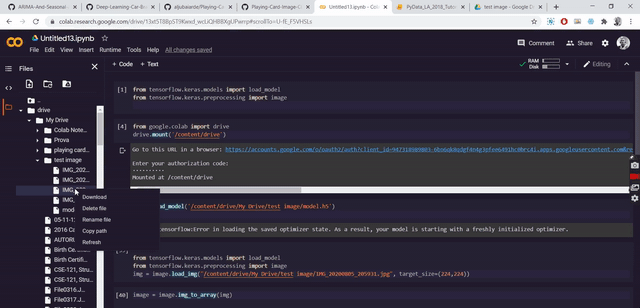

# Playing-Card-Image-Classification



## Overview
Transfer Learning based Image prediction model which identifies playing card from 52 different classes. 

## Data
- Manually Collected (Picture captured, Video converted to Image)
- Web Scraping ( Download Google Image)
- Data Augmentation (ImageDataGenerator)

## Data Cleaning
- I had to manually cleaned the data several times. Data collection and cleaning took a lot portion of time.

## Tools
#### Environment
- Google Colaboratory
#### Libraries
- Keras
- Transfer Learning (resnet50, vgg16, vgg19)
- Pandas


## Installation
The Code is written in Python 3.7. If you don't have Python installed you can find it [here](https://www.python.org/downloads/). If you are using a lower version of Python you can upgrade using the pip package, ensuring you have the latest version of pip. To install the required packages and libraries, run this command in the project directory after [cloning](https://www.howtogeek.com/451360/how-to-clone-a-github-repository/) the repository:
```bash
pip install -r requirements.txt
```
